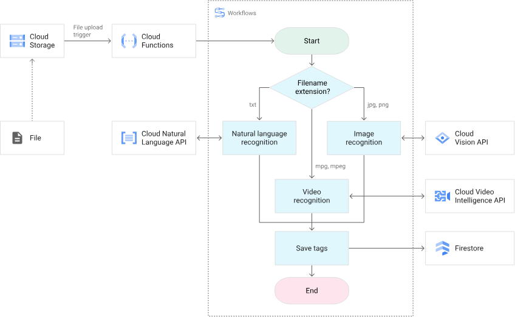

# バッチ処理 ベストプラクティス

# はじめに

バッチ処理をできるだけ抜け漏れなく設計したかったので、自分用のチェックリストを作成しました。バッチ処理の規模によって、このリストを全く使わないこともあるでしょうが、ある程度複雑なバッチ処理では、このリストを利用して設計・実装を行うつもりです。

なお、バッチ処理はDB選定やロギングなど、それ単体でベストプラクティスが存在し得る大きなテーマを複数内包する場合があります。本ドキュメントでは、チェックリストとしての網羅性や実用性を重視し、それらをあまり深追いせずに30〜50個程度のリストに抑えたいと考えています。

複数のステップが存在するバッチ処理の図  
[https://cloud.google.com/workflows/docs/overview](https://cloud.google.com/workflows/docs/overview?hl=ja) より引用

# 最初は完璧でなくとも良い

バッチ処理開発の初期段階では、このリスト全体を一度見渡し、気になる箇所だけやる・やらないの判断ができていれば十分だと思います
（全体の10％〜30％程度に対して判断できていれば良いです）。

初期段階が終わり、次の段階に進む場合は、改めてこのリスト全体を見直して気になる部分を探しましょう。

また、これだけの項目に対応することは当然難しいので、バッチ処理の開発時には後で改修しやすいように拡張性を持たせることを意識しましょう。

# チェックリスト

## 不用意にバッチ処理を作らない

- [ ] そもそもOLTP(オンライントランザクション処理)で対応できないか考える
  - 処理時間やパフォーマンスに問題があった場合、例えばデータベースインデックスの追加などでバッチ処理を作らずに解決できないかを検討する

## 起動・中断・再開・終了

- [ ] 起動方法を用意する
  - 手動実行用コマンド(Node.jsならpackage.jsonのscriptsやcommander.js等)
  - Cron等を利用した定期実行(毎日0時や月末等)
  - PubSub等の非同期メッセージング
  - GCS等のファイルイベント(バケットへのファイル追加等)
  - REST API等からの起動….等
- [ ] 中断方法を用意する
  - SIGTERMやSIGINTを受信した時(最初はCTRL+Cで止まるだけでも十分かもしれない)
  - 一定時間を超えた場合(1時間で終わる作業が2時間を超えた場合等)
  - 上記中断がトリガされた場合に終了スクリプト実行やログ表示、外部通知等をおこなう
- [ ] 再開方法を用意する
  - 手動で中断あるいは異常終了された状態から、再開できるコマンドを用意しておく
  - シンプルな設計として敢えて中断したステップからは再開できない設計もありえる
  - 再開を許す場合は、各ステップが冪等性のある実装になっているようにする
- [ ] 終了処理を考える
  - 単に処理を終了するだけではなく、処理の成功・終了通知や処理にかかった時間のログ表示や外部通知等が必要か考える。

## **バッチ処理内の各ステップ設計とステータス管理**

例えばバッチ処理全体が

- データの取り込み
- 処理
- 結果の出力

の流れで動作する際に、それぞれの段階をステップと呼んだ場合に以下に注意しましょう

(TIPS: 例えばTypeScriptなら、各STEPの共通部分を抽象クラス等に切り出すとよい)

- [ ] 各STEPのステータス管理を適切にする
  - 例えばSTEP毎に RUNNING / FINISHED / FAILED などのステータスが考えられる
  - ステータスはRDBに保存したり、PubSubで送信したりして利用する
  - これらのステータスは後続処理の継続・中断の判断や、全体の進捗状況の把握に役立つ
- [ ] 各STEPの粒度を適切にする
  - STEPのステータス管理やコード管理の観点から適切な粒度で分けることが望ましい
  - GoogleWorkflowやArgoWorkflowなどを使うとき、あるいはステップごとに異なるインスタンス等を使う場合、CPUやメモリ等を調整してリソース効率を改善できる
- [ ] 各STEPを並列化できないか考える(高速化する)

  - 複数インスタンスでの並列化を検討する
  - 単一インスタンスだが、複数CPUでの並列化を検討する

        (TIPS): Node.jsであっても実装によっては複数CPUを利用できる

- [ ] 各STEPを直列化できないか考える(シンプルにする)
  - 多少遅くなっても、コードがシンプルになりバグが減るのであれば敢えて直列にする
- [ ] ワークフロー管理ツールの導入を検討する
  - A → B → Cという直線的な処理だと専用のワークフローツールは不要な場合が多い
  - A → B0~B100 → Cという複雑な処理だと、Bを複数の別インスタンスで実行したり、Cの開始はBのN個の処理を待ち受ける等の処理が必要になる。この場合はワークフロー管理ツールを使った方が楽な場合がある
- [ ] STEP毎に必要な計算リソースの落差が大きい場合は実行インスタンス等の分割を考える
  - A → Bという直線的な処理であっても、A(100分かかるがMemoryは1GBで十分) → B(1分で終わるがMemoryは32GB必要)の処理でBだけが大量にメモリを使い、そこだけのためにインスタンスのメモリを32GBにするのは無駄。
  - 各STEPをPubSub等を利用して非同期で別インスタンス等で実行する方法だけではなく、簡素化のためRestAPI等を利用して同期的に実行する方法も考える。
    (上記の例で言うと、32GBメモリが必要だが1分で終わるStepBはREST API等にしてメインのバッチ処理から同期的に呼び出すようにする手がある)

## 監視・通知・トレース・メトリクス

バッチ処理は人間の目に触れやすいフロントアプリ等と異なり、異変に気付きにくいという側面があります。システムの重要度に応じて監視や通知設定を行いましょう。

- [ ] バッチ処理の結果を通知する
  - 成功/失敗などのステータスや、必要に応じて処理にかかった時間等を通知することを検討しましょう
  - バッチの処理数が多い場合や、要件に応じて、まずは失敗時だけ通知するという手もあります
- [ ] バッチ処理全体の処理時間が長すぎる場合に通知する
  - 何らかの実装ミスあるいは処理するデータが増大した時に、想定外の費用が発生することを防げます
  - 1時間毎に行うバッチ処理が1時間以上かかった場合などに、バッチ処理が競合する事態などを避けられます(バッチ処理の突き抜け対策)
- [ ] バッチ処理内の各単一のステップが長すぎる場合に通知する
  - バッチ処理のボトルネックを発見しやすくなります
- [ ] リソースの利用率を監視・通知する
  - OOMなどが発生しないように、メモリ利用率を監視しましょう。また必要に応じてCPU利用率やDisk利用率も監視し、閾値を超えた場合通知するようにしておいた方が良いでしょう。
  - バッチ処理に利用するインスタンスそのものだけではなく、関連システム(例えばデータベース)等の監視も必要に応じて行いましょう。
- [ ] 通知内容に、バッチ処理のIDを含める
  - バッチ処理のID(例えばCloudRunJobsならJobID)を通知内容に含めることで、エラー発生時やデバッグ時に調査がしやすくなります。
- [ ] OpenTelemetry等を導入し、バッチ処理の各ステップのトレースをある程度横断的に把握できるようにする
- [ ] メトリクスの確認方法を用意する
  - 処理のボトルネックを見つけたり、スケールアップ/ダウンの判断材料としてメトリクスを確認するダッシュボードなどが必要です。
  - 例えばCloudRun Jobsでは、追加の設定なしにメトリクス確認用のダッシュボードが付属しています

## ロギング

バッチ処理のロギングはシステムの状態把握や問題対応を容易にし、トラブルシューティング、パフォーマンス監視、監査、通知、データ分析に役立ちます。

なお、ロギングはそれ自体が大きく複雑なベストプラクティスを持ちうる大きなテーマですので、以下ではバッチ処理の観点からの最低限のチェックリストにとどめます。

- [ ] バッチ処理の各STEPの開始・終了時にログ出力を行う
- 各STEPの始まりと終わりに「Start StepXXX」等とログ表示し、終了時には「End StepXXX (12 sec)」のように処理にかかった時間を出力する
- [ ] ログレベルの設計を行う
  - 単一のログレベルだとログの流量を制御できず、場合によっては大切なログがあまり重要でないログに埋もれてしまいます。最低限Info / Debug / Error などのEnum型のログレベルを使うか、あるいは10, 100などの数値型で＞＝(大なりイコール)等の数式でクエリしやすいログレベルの設計を行いましょう
  - 本番環境でのバッチ処理の実行時や、手元での実行時に必要に応じたログレベルを設定できるようにしましょう
  - テスト時等に不要なログを出さないようにすることで、開発生産性が向上します。
  - 開発環境において、構造化ログはヒューマンリーダブルではない場合があります。クラウドでは構造化ログを出力するが、手元の開発環境では可読性の高い通常のテキストを表示するといった設計も検討しましょう(NPMのPinoはこういった機能を自前で持っています)
- [ ] 構造化ロギングを行う
  - 構造化ロギングによりログの形式を統一し、データの一貫性を保つ必要があります。これにより、ログの分析やトラブルシューティングが容易になり、システムのパフォーマンス向上にも寄与します。具体的には、各ログエントリにタイムスタンプやログレベル、メッセージなどの情報を含めることが重要です。
  - 例えばCloudLogging等を利用する場合はmessageフィールド、severityフィールド、traceフィールド、spanIdフィールド等は特別な意味を持つことを意識しましょう
- [ ] ログの保存場所を決める
  - 単にログを標準出力に表示しるだけではなく、例えばGCPだと任意のログバケットに流し込むことで、保存期間やログの分類、アクセス制限などを行いやすくなります。
- [ ] ログの保存期間・ライフサイクルを決める
  - ログの保存目的に合わせて、保存期間を決めましょう。また必要に応じてログをColdStorageに移動したり、自動削除する設定を行いましょう。
- [ ] (Advanced): ある種のアプリケーションログ等をユーザに見せる必要があるか検討する
  - 監査ログ等の機能として、ユーザにログの内容を見せる必要がある場合は、より高度・全く別の設計が必要です。直近あるいは将来的にそういったユーザ表示の必要があるか確認しましょう。

## スケーラビリティと未来予測

- [ ] 一回のバッチで処理するデータ量
  - 現在だけでなく、数年後のデータ増加量も加味して試算しましょう。
- [ ] 一回のバッチ処理に必要な時間について試算する
  - 別記のバッチ処理の突き抜け対策としても、数年後の処理量の増加を見越して試算しましょう。
- [ ] 処理が追いつかなかった場合のスケーリング方法を検討しておく
  - 垂直/水平スケールする方法や、スケールした場合の上限について確認しておきましょう

## DB・ストレージ関連

バッチ処理結果の保存が必要な場合、適切なデータベースやオブジェクトストレージを選定しましょう。

- [ ] バッチ処理結果を保存するデータベースやオブジェクトストレージを選定
  - オブジェクトストレージ
  - OLAPが目的のRDB(PostgresやMySQL等の行指向DB等)
  - DWH, OLAP用のDB(BigQueryやClickHouse等の列指向DB等)
  - NoSQL DB
- [ ] データのライフサイクルを定める
- もし1年以上古いデータは削除するといったルールがある場合、オブジェクトストレージならライフサイクル設定を行い、RDBなどでは定期削除する処理を追加しましょう

## バッチ処理を実行するインフラ選定

例えばサーバレスのCloudFunctions等で処理するのか、それともCloudBatchやCloudRunJobsなどを使うのかなどのインフラを選定しましょう

- [ ] バッチ処理のインフラを選ぶ
  - 例えばCloudRun Jobsは最大でも24時間までしか実行できないことなどに留意しましょう
  - 一方でCloudRun Jobsはデフォルトで素晴らしいメトリクスのページが使えます

## そもそもの前提確認

- [ ] OLTPで対応できないか考える

## テスタビリティ

- [ ] テストを書きやすいようにする
  - 例えばバッチ処理の各ステップを独立してテストできるような仕組みを考えましょう

## 回復性・冪等性

- [ ] 必要に応じて一部のステップ/処理が失敗しても、バッチ処理全体としては最後まで処理が走り切るようにすることを検討しましょう(もちろん敢えて中断させることも同じく検討しましょう)
- [ ] バッチ処理が２重実行されてはいけない場合は、対策をおこないましょう
  - 例えば1時間ごとに行うバッチ処理に対して、前回の処理が1時間を超えて実行が続いている場合に重複が発生します。
- [ ] バッチ処理をリトライする方法を用意しておきましょう
  - 自動リトライと手動リトライそれぞれについて検討しておきましょう
  - リトライ時に中断されたステップから再開する方法についても検討しておきましょう

## ドキュメンテーション

- [ ] バッチ処理の技術選定や設計をドキュメント化する(ADR等)
  - なぜこの実行基盤を選んだのか
  - なぜこのデータベースを選んだのか
  - なぜこのワークフロー管理ツールを選んだのか…等を記録として残しましょう
- [ ] バッチ処理の運用方法をドキュメント化する
  - バッチ処理の起動方法
  - バッチ処理のリトライ方法
  - バッチ処理の中断方法…等をドキュメント化しましょう

# 参考資料

- [https://www.yamarkz.com/blog/implementation-practices-for-batch-processing](https://www.yamarkz.com/blog/implementation-practices-for-batch-processing)
- [https://engineering.mercari.com/blog/entry/2019-02-27-112650/](https://engineering.mercari.com/blog/entry/2019-02-27-112650/)
